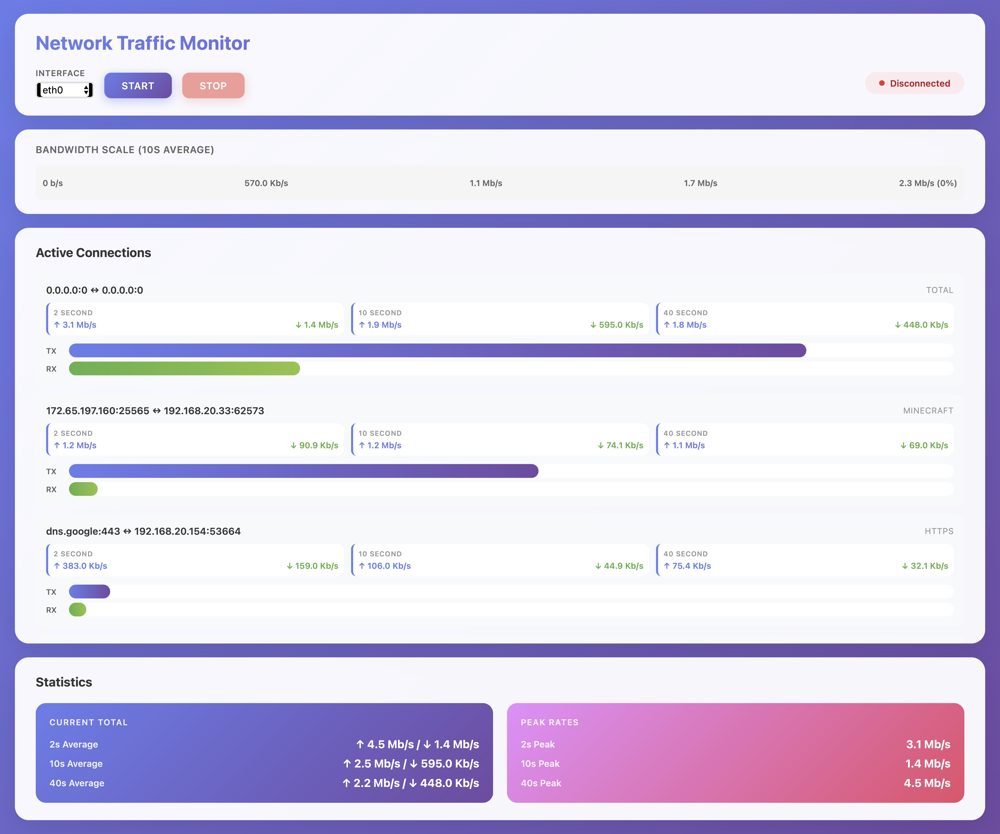

# Web interface to [iftop](https://pdw.ex-parrot.com/iftop/)

This project wraps iftop through a websockets interface, and a web frontend to display the connections.

## Backend - Python

Requires `asyncio`, `websockets`.

```
./iftop-backend.py  # Needs to be root to run iftop and sniff interfaces
```

## Frontend

Create `config.json`

```json
{
  "ws_url": "wss://example.org/iftop/ws",
  "interfaces": [
    {"id": "eth0", "max": 500000000},
    {"id": "eth1", "max": 500000000}
  ]
}
```

### Screenshot


